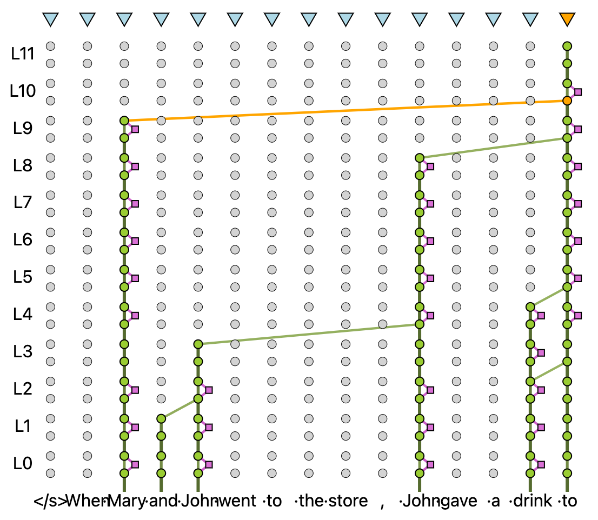

# LLM transparency tool



## Key functionality

* Choose your model, choose or add your prompt, run the inference.
* Browse contribution graph.
    * Select the token to build the graph from.
    * Tune the contribution threshold.
* Select representation of any token after any block.
* For the representation, see its projection to the output vocabulary, see which tokens
were promoted/suppressed but the previous block.
* The following things are clickable:
  * Edges. That shows more info about the contributing attention head.
  * Heads when an edge is selected. You can see what this head is promoting/suppressing.
  * FFN blocks (little squares on the graph).
  * Neurons when an FFN block is selected.

## Install and run

### From docker image

```bash
# From the repository root directory
docker build -t llm_transparency_tool:latest .
docker run -p 80:80 llm_transparency_tool:latest
```

### For development
[!NOTE]
TODO(igortufanov): Adjust the repo name and the paths

```bash
# From the repository root directory
pip install -e .
pip install -r requirements.txt

cd ./llm_transparency_tool/components/frontend
yarn install
yarn build

cd ../../../
streamlit run ./llm_transparency_tool/server/app.py -- ./llm_transparency_tool/config/local.json
```

## Adding support for your LLM

Initially, the tool allows you to select from just a handful of models. Here are the
options you can try for using your model in the tool, from least to most
effort.

### The model is already supported by TransformerLens

Full list of models is [here](https://github.com/neelnanda-io/TransformerLens/blob/0825c5eb4196e7ad72d28bcf4e615306b3897490/transformer_lens/loading_from_pretrained.py#L18).
In this case, the model can be added to the configuration json file.

### Tuned version of a model supported by TransformerLens

[!NOTE]
TODO(igortufanov): Add an example

Add the official name of the model to the config along with the location to read the
weights from.

### The model is not supported by TransformerLens

In this case the UI wouldn't know how to create proper hooks for the model. You'd need
to implement your version of
[TransparentLlm](./models/transparent_llm.py) class and alter the
Streamlit app to use your implementation.